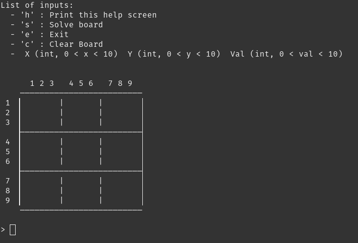
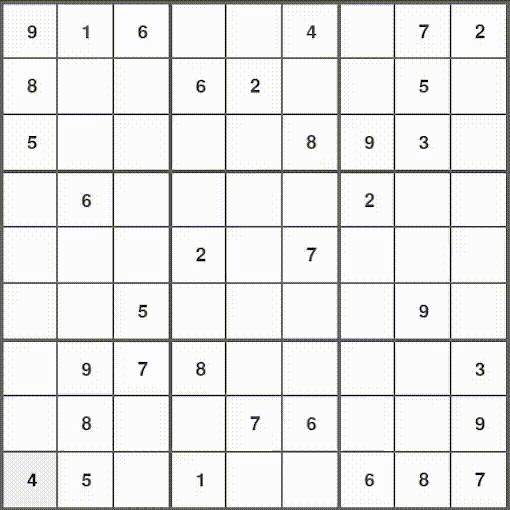

# Sudoku Solver

## Introduction
This is a simple application, in both terminal and gui format, that solves sudoku. Fill the grid with the numbers on a valid sudoku grid, and watch the backtracking algorithm solve the board!

## Backtracking algorithm

Backtracking is a recursive approach for finding solutions to some computational problems. Backtracking gradually finds candidate solutions and abandons candidates, i.e., "backtracks" when a candidate cannot be a good solution.

## Run the application
- Clone or download the github repository
- Install requirements
- Run

`$ git clone git@github.com:AzracStudios/sudoku_solver`

`$ cd sudoku_solver`

`$ pip install -r requirements.txt`

For interactive text mode: `$ python3 main.py --text`

For gui mode: `$ python3 main.py --gui`

## Resources
Backtracking algorithm: https://en.wikipedia.org/wiki/Backtracking

Pygame documentation: https://www.pygame.org/docs/

